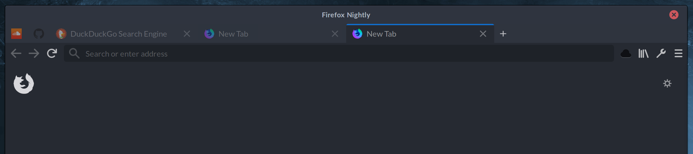
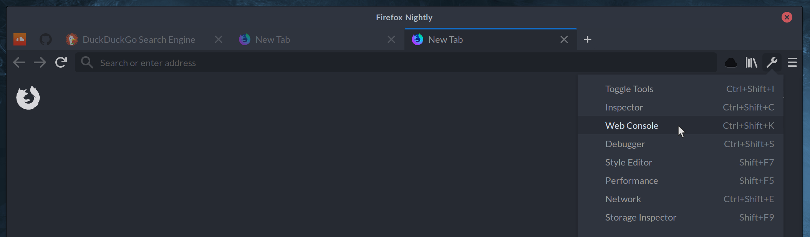
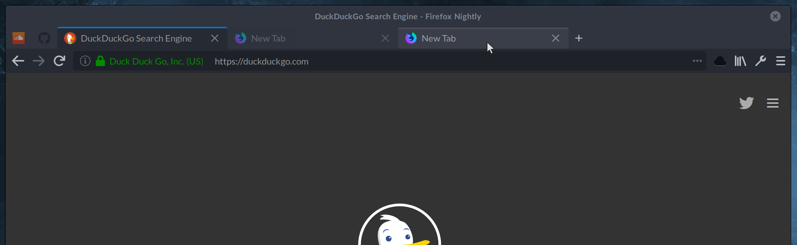

# Firefox Theme - Arc-Darker-Flat

This is a theme based on CSS overrides in [userChrome.css & userContent.css](https://www.userchrome.org/). It changes the look of the default dark firefox quantum theme to resemble the [arc darker gtk theme](https://github.com/horst3180/arc-theme) in a borderless style.

## Install Theme
* Go to firefox profile folder ("about:support" -> "Profile Directory" -> "Open Directory")
* Create a folder "chrome" inside the firefox profile folder and add userChrome.css & userContent.css from the repository
**or**
* `cd [FIREFOX_PROFILE_FOLDER] && git clone git@github.com:jens-t/firefox-theme-arc-darker-flat.git chrome`
* set the default "Dark" theme & the density to "Compact" in firefox settings

## Screenshots

